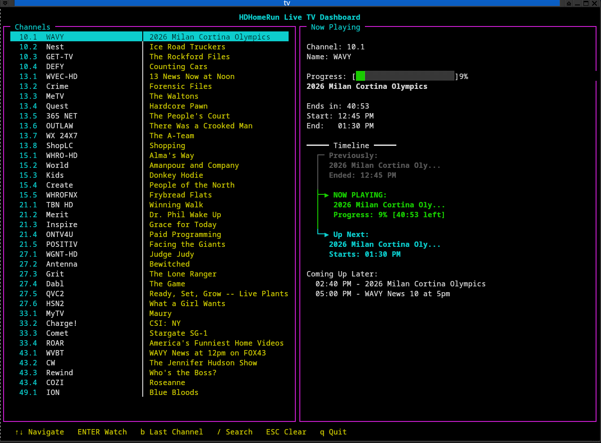

# tvtui 

A terminal-based Live TV dashboard for HDHomeRun + Jellyfin, powered by `curses` and `mpv`.

Browse channels, see what’s currently playing, view progress in real time, and launch streams instantly — all from your terminal.

- Disclaimer: A lot of AI help in making this project. 
---

## Features

- Two-pane curses UI with colors & borders
- Live channel list from HDHomeRun
- Current program info from Jellyfin EPG
- Color-coded progress bar (green → yellow → red)
- Human-readable local times
- One-key playback via `mpv`
- No transcoding required
- Works great in tmux
- Secrets/config stored in `.env`

---

##  Screenshot




---

## Requirements

- Python 3.10+
- `mpv`
- HDHomeRun tuner
- Jellyfin server with Live TV configured

Python dependencies:

```bash
pip install python-dotenv
```

## Setup

### Clone Repo
```bash
git clone git@github.com:codechopper757/tvtui.git
cd tvtui
```
### Create .env

```bash
cp sample.env .env
```
### Edit .env

```bash
HDHR_IP=<your HDHomerun IP>
JELLYFIN_URL=<Jellyfin URL:Port>
JELLYFIN_API_KEY=your_api_key_here
```

### Make executable

```bash
chmod +x tvtui
```
